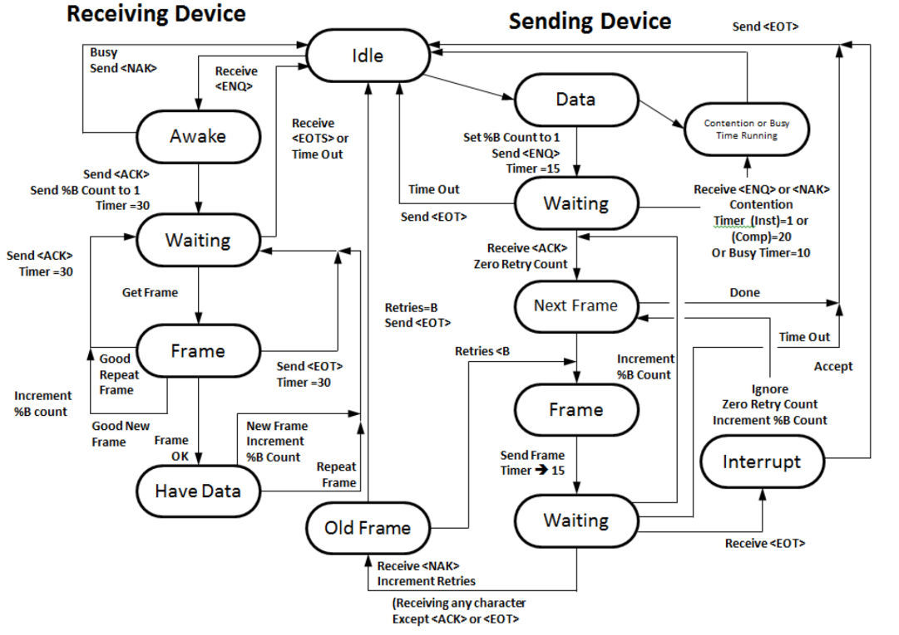

# AstmTcpServer
__version 0.1__  

Serveur de reception ASTM E1381.  

Le format de message ASTM associé au protocole ASTM E1381 est un protocole de communication bas-niveau structuré en trames (frames), utilisé pour l’échange de données entre instruments de laboratoire et systèmes informatiques.  



---

### 🧱 **Structure d’une trame ASTM (E1381)**

#### 📦 Format général d’une trame :
- **Trame intermédiaire (middle frame)** :
  ```
  <STX> FN texte <ETB> C1 C2 <CR><LF>
  ```
- **Dernière trame (last frame)** :
  ```
  <STX> FN texte <ETX> C1 C2 <CR><LF>
  ```

#### 🧩 Détails des composants :
| Élément | Description |
|--------|-------------|
| `<STX>` | Start of Text (HEX 02) |
| `FN` | Numéro de trame (modulo 8, de 1 à 7 puis 0) |
| `texte` | Données (max. 240 caractères) |
| `<ETB>` / `<ETX>` | Fin de trame intermédiaire (HEX 17) / fin de trame finale (HEX 03) |
| `C1 C2` | Checksum (somme des valeurs ASCII de la trame, exprimée en hexadécimal) |
| `<CR><LF>` | Fin de ligne (HEX 0D et 0A) |

---

### 🧬 **Structure logique des messages**

Un **message ASTM** est composé de plusieurs **enregistrements (records)**, eux-mêmes composés de **champs (fields)** :

- **Message** : unité complète d’information (ex. : demande de test, résultat).
- **Record** : commence par un identifiant (ex. : `H` pour Header, `P` pour Patient, `O` pour Order, `R` pour Result, etc.).
- **Field** : séparé par des délimiteurs.

#### 🔣 Délimiteurs standards :
| Type | Symbole | Description |
|------|---------|-------------|
| Champ | `|` | Sépare les champs |
| Répétition | `\\` | Pour les champs répétés |
| Composant | `^` | Pour les sous-champs |
| Échappement | `&` | Pour insérer un délimiteur dans un champ |

---

### 🔄 **Phases de transmission**
1. **Établissement** : ENQ → ACK
2. **Transfert** : envoi des trames ASTM
3. **Terminaison** : EOT

---
Exemple d'un fichier format ASTM E1394 :  

``` csv
H|\^&|||LABO-SHAB^1234^1|LIS-01||20250707160000||P|1|20250707160000
P|1||123456||DUPONT^Jean||19800101|M||||||||||||||||||||||
O|1|ORD12345||^^^GLU^Glucose|||20250707153000||||||||1|||||F
R|1|^^^GLU^Glucose|5.6|mmol/L|4.0-6.0|N|||F
L|1|N
```    
 ---  

<u>AstmTcpServer permet</u> :  
- un retour vers un format fichier sur disque.  
- Un retour vers une socket tcp/ip encapsulé en MLLPv2.  
- Un parse sur l'écran de la console.  

